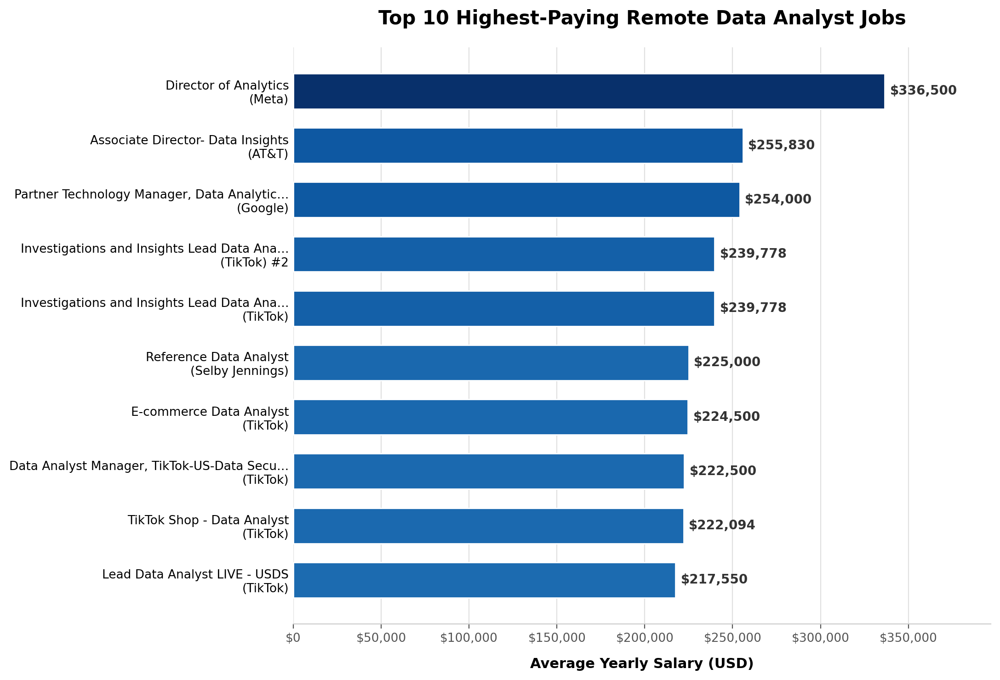
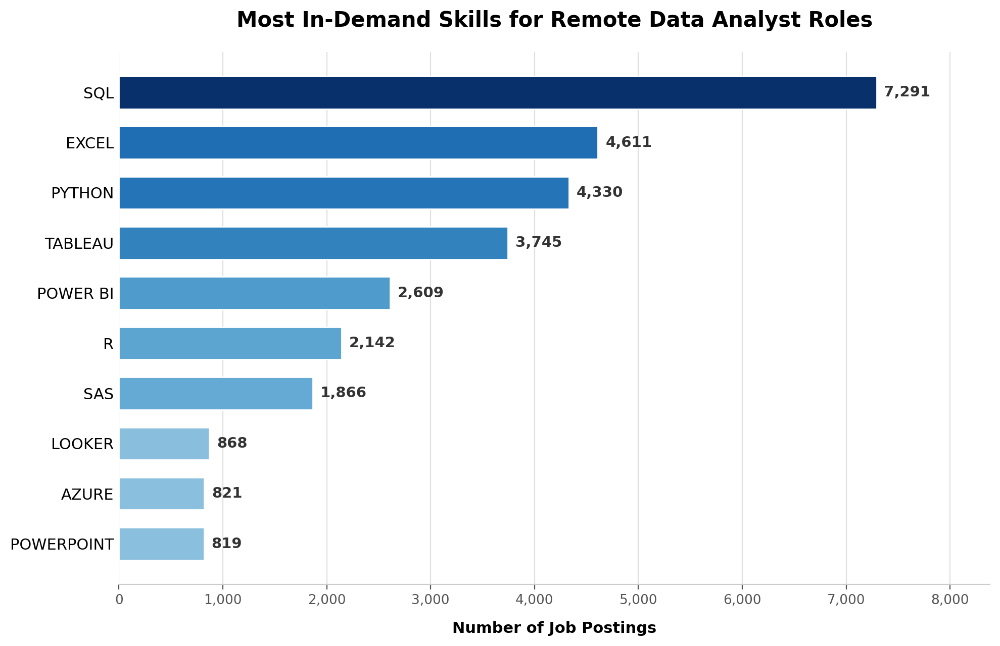
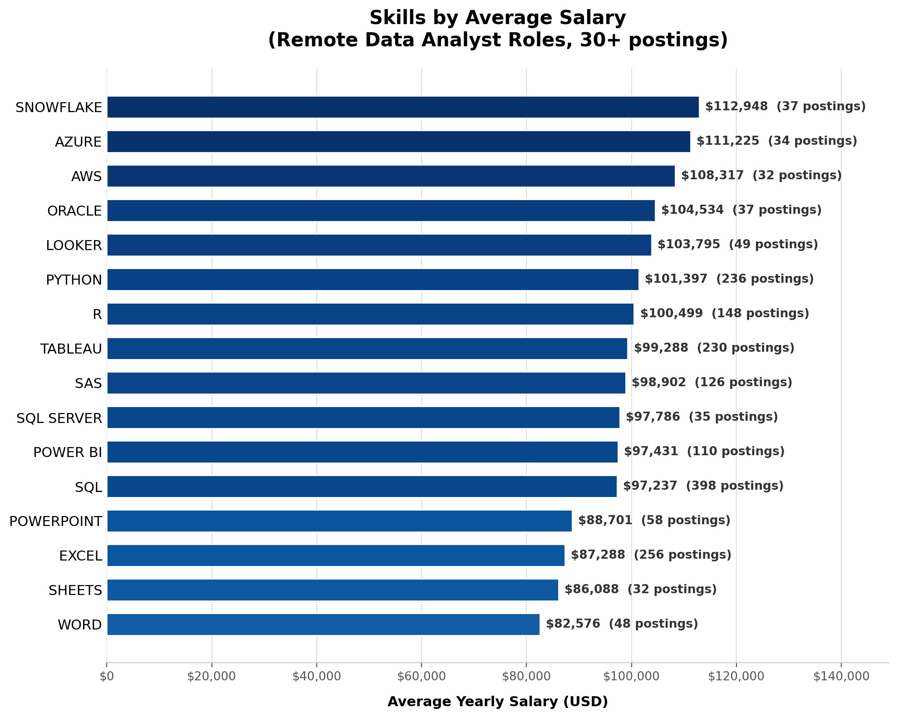
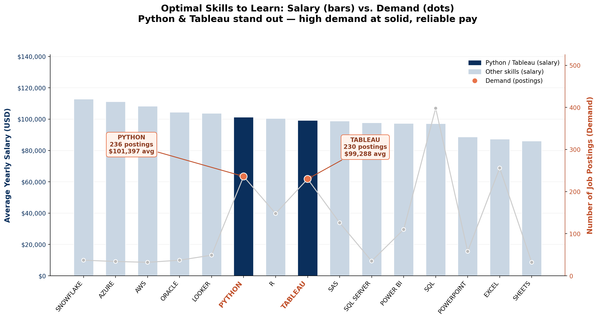

# Remote-Data Analyst Job Market Insights

## Overview
This project analyzes real-world job posting data to answer a practical question: 
what skills should someone learn to break into or grow in a Data Analyst career? 

Using SQL, I explored ~788,000 job postings to uncover which skills are most in 
demand, which pay the most, and which offer the best balance of both — with a 
focus on remote-friendly roles.

## Dataset
The data comes from [Luke Barousse's Data Analyst job postings dataset](https://lukebarousse.com/), 
covering job postings scraped from Google job search results. The dataset includes:

- **job_postings_fact** – ~788,000 job postings with title, location, salary, and remote-work status
- **company_dim** – company names and details
- **skills_dim** – a lookup table of individual skills (e.g. SQL, Python, Excel)
- **skills_job_dim** – a bridge table linking job postings to the skills they require

I loaded this data locally into PostgreSQL and queried it using SQL in VS Code.

## Tools Used
- **SQL (PostgreSQL)** – core querying, joins, CTEs, aggregations
- **VS Code** with SQLTools extension – writing and running queries
- **Git & GitHub** – version control and project hosting

## The Questions

1. **What are the top 10 highest-paying Data Analyst jobs?**
   Filtered to companies with multiple postings to avoid outlier salaries skewing results.

2. **What skills are most in demand for Data Analyst roles?**
   Focused on remote positions to reflect the growing remote job market.

3. **Which skills are associated with the highest average salaries?**
   Filtered to skills appearing in 5+ postings to ensure the averages are statistically meaningful.

4. **What are the optimal skills to learn — high demand AND high pay?**
   Combined demand and salary data, filtered to skills with 10+ postings, to surface the best 
   skills to prioritize learning.

---

## Findings

### 1. Top 10 Highest-Paying Remote Data Analyst Jobs

| Job Title | Company | Salary (avg) |
|---|---|---|
| Director of Analytics | Meta | $336,500 |
| Associate Director – Data Insights | AT&T | $255,830 |
| Director, Data Analyst – Hybrid | Inclusively | $189,309 |
| ERM Data Analyst | Get It Recruit – IT | $184,000 |
| DTCC Data Analyst | Robert Half | $170,000 |
| Azure Data Python Consultant | Kelly Science, Engineering, Tech & Telecom | $170,000 |
| Director of Data Analytics | A-Line Staffing Solutions | $170,000 |
| Manager, Data Analyst | Uber | $167,000 |
| Data Analyst | Get It Recruit – IT | $165,000 |
| Principal Data Science Analyst | Mayo Clinic | $164,746 |

Top salaries cluster around specific companies rather than a specific industry — 
Meta, AT&T, and Uber sit alongside healthcare (Mayo Clinic) and staffing firms, 
suggesting company choice can matter as much as skill choice when targeting top compensation.

### 2. Most In-Demand Skills

| Skill | Demand Count |
|---|---|
| SQL | 7,291 |
| Excel | 4,611 |
| Python | 4,330 |
| Tableau | 3,745 |
| Power BI | 2,609 |
| R | 2,142 |
| SAS | 1,866 |
| Looker | 868 |
| Azure | 821 |
| PowerPoint | 819 |

SQL is the clear foundation skill — appearing in nearly 60% more postings than 
the next closest skill (Excel), and over 8x more than niche tools like Looker or Azure.

### 3. Skills Associated with the Highest Salaries

| Skill | Avg Salary | Demand Count |
|---|---|---|
| Pandas | $151,821 | 9 |
| NumPy | $143,513 | 5 |
| Databricks | $141,907 | 10 |
| Atlassian | $131,162 | 5 |
| Airflow | $126,103 | 5 |
| Scala | $124,903 | 5 |
| Crystal | $120,100 | 5 |
| Go | $115,320 | 27 |
| Confluence | $114,210 | 11 |
| Hadoop | $113,193 | 22 |

Several of the highest-paying skills (NumPy, Atlassian, Airflow, Scala, Crystal) 
sit right at the 5-posting minimum threshold — a reminder that these averages, 
while statistically filtered, are still based on a small sample and should be 
read as directional rather than definitive.

### 4. Optimal Skills — High Demand AND High Salary

| Skill | Avg Salary | Demand Count |
|---|---|---|
| Databricks | $141,907 | 10 |
| Go | $115,320 | 27 |
| Confluence | $114,210 | 11 |
| Hadoop | $113,193 | 22 |
| Snowflake | $112,948 | 37 |
| Azure | $111,225 | 34 |
| BigQuery | $109,654 | 13 |
| AWS | $108,317 | 32 |
| **Python** | **$101,397** | **236** |
| **Tableau** | **$99,288** | **230** |

Python and Tableau stand out from the rest of this list: while niche tools like 
Databricks command a higher average salary, they appear in far fewer postings. 
Python and Tableau strike the best balance — appearing in 200+ postings each while 
still paying competitively (~$100K average) — making them lower-risk, high-value 
skills to prioritize over rarer, higher-paying niche tools.

---

## Key Takeaways

- **Top salaries cluster around specific companies, not just industries.** The highest-paying 
  remote Data Analyst postings ranged from roughly $165K to $336K, with major tech and 
  logistics companies (Meta, AT&T, Uber) appearing prominently.
- **SQL is essential.** It appears in more Data Analyst postings than any other skill 
  (7,291 postings) — by a wide margin over the next closest skill, Excel.
- **Some niche skills pay a premium.** Skills like Pandas, NumPy, and Databricks command 
  the highest average salaries, but appear in relatively few postings — likely reflecting 
  specialized or senior roles rather than typical entry points.
- **Python and Tableau offer the best balance.** Both appear in 200+ postings while still 
  commanding strong average salaries (~$100K), making them high-value, lower-risk skills 
  to prioritize compared to rarer, higher-paying niche tools.
- **Data quality matters as much as the analysis.** During this project, I caught and 
  filtered out several distortions — a single high-salary outlier from a low-posting-volume 
  country, and skills whose "average salary" was based on just one or two job postings. 
  Without these filters, the results would have been misleading.

## What I Learned

- How to write multi-table JOINs across fact and dimension tables to connect job 
  postings, companies, and skills
- Using CTEs to break complex logic into readable, reusable steps
- The importance of filtering for statistical reliability (e.g. `HAVING count(...) >= N`) 
  rather than trusting raw averages at face value
- How small-sample distortions can silently skew results, and how to catch them 
  before drawing conclusions
- Structuring a project end-to-end: from raw data, to querying, to visualizing, 
  to communicating findings

